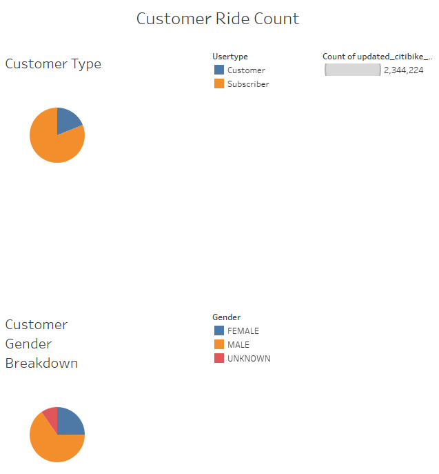

# bikesharing

Tableau links:
 
Click [here](https://public.tableau.com/app/profile/peter.gitwekere/viz/NYCitiBikeAnalysis_16637366339800/NYCCitiBikeAnalysis) to access the NYC CitiBike story in Tableau.

Click [here](https://public.tableau.com/app/profile/peter.gitwekere/viz/NEWYORKCITIBIKEDASHBOARD/NYCCitibikeDashboard) to access the NYC CitiBike Dashboard in Tableau.

# Overview of Project

The purpose of this project was to analyze bikeshare data for the month of August from CitiBike in New York City to present it to investors who are interested in investing to the bikeshare program. Key points of focus include :

- Identifying checkout times for users
- Identifying checkout times by Gender
- Identifying trips by weekday for each hour
- Identifying trips by gender (Weekday per Hour)
- Identifying user trips by gender by week

### Results

After analyzing the data, we discovered that more than three-quarters of the users are Subscribers. A reliable source of income for the bikeshare program. The analysis also showed that most users were primarily of the male gender. Below is an image with a breakdown of all the users. 

A heatmap was designed from the analysis to visualize weekly usage patterns as seen below. Heavy bike usage can be observed during weekday commute times unlike the weekends when it is all spread out. The only exception is on Wednesday when there is low bike usage as per the chart which may indicate an opportunity to explore.

The number of trips by duration graph verifies that majority of the trips taken were under an hour. The image below shows the trends.

Ultimately, the heatmap below showcases the user type by gender which verifies the vast majority of subscribers being male.

 

Summary

In conclusion, the bikeshare program would be a great investment mostly in densely populated areas due to demand. In addition, the percentage of subscribers versus customers is a good sign to the investment. More research needs to be carried to ensure incorporation of female riders.
  
